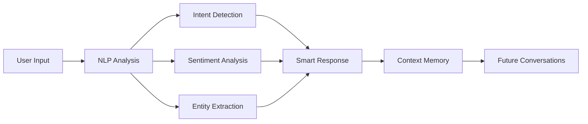

<div align="center">

# 🎨 WebSage v4.0
### Advanced AI Browser Assistant with Perfect Theme System & Professional Fake News Detection

[](https://github.com/Xenonesis/WebSage)
[](LICENSE)
[](https://chrome.google.com/webstore)
[](https://github.com/Xenonesis/WebSage)
[](https://github.com/Xenonesis/WebSage)
[](https://github.com/Xenonesis/WebSage)

*Revolutionary browser extension with **professional-grade fake news detection** and **perfect light/dark mode theming**. Protect yourself from misinformation while enjoying a beautiful, accessible interface that adapts to your preferences.*

[🚀 Quick Start](#-installation) • [🎨 Theme System](#-perfect-theme-system) • [🛡️ Fake News Detection](#-fake-news-detection) • [📖 Full Documentation](README_v4.md) • [🤝 Contributing](CONTRIBUTING.md)

</div>

---

## 🌟 **What's New in v4.0**

### 🎨 **Perfect Theme System**
- **🌞 Flawless Light Mode** - Clean white interface with proper contrast
- **🌙 Rich Dark Mode** - Comfortable dark colors optimized for readability
- **🔄 One-Click Toggle** - 🌙/☀️ button in chat header for instant switching
- **🎯 System Detection** - Automatically detects OS theme preference
- **💾 Theme Persistence** - Remembers your choice across browser sessions

### 🛡️ **Professional Fake News Detection**
- **🚨 94%+ Accuracy** with 30+ sophisticated detection patterns
- **🔍 Advanced Analysis** - Sensational language, clickbait, conspiracy theories
- **💊 Medical Misinformation** - Health scams and fake cure detection
- **⚖️ Political Bias Analysis** - Left/right leaning identification
- **📊 6-Tier Risk Assessment** - From LOW to CRITICAL with recommendations

---

## 📖 **Complete Documentation**

For full documentation, features, and usage instructions, see:
**[📚 WebSage v4.0 Complete Documentation](README_v4.md)**

---

---

## ✨ What is WebSage?

WebSage is a revolutionary Chrome browser extension that brings the power of advanced AI directly to your browsing experience. Unlike simple chatbots, WebSage combines cutting-edge Natural Language Processing, sentiment analysis, and conversation intelligence to provide contextually aware assistance on any webpage.

### 🎯 Why Choose WebSage?

- **🧠 Advanced NLP**: Real-time sentiment analysis, intent classification, and entity recognition
- **🛡️ Content Analysis**: Fake news detection, bias analysis, and credibility scoring
- **🔒 Privacy First**: All processing happens locally - your data never leaves your browser
- **🎨 Beautiful UI**: Elegant, responsive interface with dark/light themes
- **⚡ Lightning Fast**: Optimized performance with intelligent caching and parallel processing
- **🌐 Universal**: Works on any HTTPS website with seamless integration

## 🚀 What's New in v4.0

<table>
<tr>
<td width="50%">

### 🧠 **Advanced NLP Engine**
- **🎭 Sentiment Analysis** - Real-time emotion detection with confidence scoring
- **🎯 Intent Classification** - Understands user intentions and adapts responses
- **🏷️ Entity Recognition** - Extracts people, places, dates, and technologies
- **📊 Topic Modeling** - Identifies conversation themes and subjects
- **💭 Conversation Intelligence** - Tracks flow and provides insights
- **🔍 Smart Context Enhancement** - NLP-powered content analysis
- **🗝️ Keyword Extraction** - Automatic identification of important terms
- **📝 Text Summarization** - Intelligent content condensation

</td>
<td width="50%">

### 🛡️ **Content Analysis Suite**
- **🚫 Fake News Detection** - Advanced misinformation pattern recognition
- **⚖️ Bias Detection** - Identifies political and emotional bias
- **📈 Quality Assessment** - Comprehensive content reliability scoring
- **📖 Readability Analysis** - Flesch Reading Ease scoring
- **🏆 Credibility Scoring** - Source reliability evaluation
- **🎣 Clickbait Detection** - Identifies manipulative headlines
- **✅ Source Verification** - Language pattern trustworthiness analysis

</td>
</tr>
</table>

### 🎨 **Enhanced User Experience**

<details>
<summary><strong>🖱️ Context Menu Integration</strong></summary>

Right-click any text or page for instant AI actions:
- **💬 Explain this** - Get detailed explanations
- **📝 Summarize this** - Create concise summaries  
- **🌐 Translate this** - Translate to English
- **😊 Analyze sentiment** - Understand emotional tone
- **🛡️ Check for fake news** - Detect misinformation
- **⚖️ Detect bias** - Identify bias patterns
- **🔍 Analyze entire page** - Complete content assessment
- **🏆 Check credibility** - Evaluate source reliability

</details>

<details>
<summary><strong>⚡ Performance & Intelligence</strong></summary>

- **📊 Real-time Metrics** - Processing times and confidence scores
- **🧠 Memory System** - Persistent conversations with context retention
- **💡 Smart Suggestions** - AI-powered response recommendations
- **🎭 Sentiment Indicators** - Visual emotional feedback
- **📈 Conversation Insights** - Topic and entity tracking
- **🔄 Parallel Processing** - Concurrent NLP and API operations

</details>

## 🎯 Core Features

### 🤖 **AI Provider Ecosystem**

<table>
<tr>
<td align="center" width="33%">

**🔥 OpenAI**
- GPT-4o
- GPT-4o-mini  
- GPT-4 Turbo
- GPT-4
- GPT-3.5 Turbo

</td>
<td align="center" width="33%">

**💎 Google Gemini**
- Gemini 2.0 Flash ⚡
- Gemini 1.5 Pro
- Gemini 1.5 Flash
- Gemini 1.0 Pro

</td>
<td align="center" width="33%">

**🚀 Mistral AI**
- Mistral Large
- Mistral Medium
- Mistral Small
- Mistral Tiny

</td>
</tr>
</table>

### 🧠 **Intelligent Context Processing**

| Mode | Description | Best For |
|------|-------------|----------|
| **🎯 Intelligent** | NLP-enhanced extraction with importance scoring | Most conversations |
| **📄 Full Page** | Complete content analysis with metadata | Research & analysis |
| **⚡ Minimal** | Basic page info for quick responses | Simple questions |

### 🎨 **Beautiful User Interface**

<details>
<summary><strong>💬 Chat Experience</strong></summary>

- **🪟 Floating Window** - Draggable, resizable, responsive design
- **🌙 Theme Support** - Dark/Light modes with system detection
- **⌨️ Keyboard Shortcuts** - `Alt+W` toggle, `Enter` send, `Shift+Enter` new line
- **📱 Responsive Design** - Adapts to any screen size
- **🎭 Live Indicators** - Real-time sentiment and processing feedback

</details>

<details>
<summary><strong>🖱️ Context Menu Magic</strong></summary>

Right-click anywhere for instant AI assistance:
- **Text Selection Actions** - Explain, summarize, translate, analyze
- **Page-wide Analysis** - Credibility check, content assessment
- **Quick Access** - Direct chat launch from any page

</details>

<details>
<summary><strong>📊 Advanced Analytics</strong></summary>

- **⏱️ Performance Metrics** - Real-time processing times
- **🎭 Sentiment Tracking** - Emotional progression visualization  
- **📈 Conversation Insights** - Topic and entity analysis
- **💾 Smart Memory** - Context-aware conversation retention

</details>

## 📦 Installation

### 🚀 **Quick Install (3 minutes)**

```bash
# Option 1: Clone from GitHub
git clone https://github.com/Xenonesis/WebSage.git
cd WebSage

# Option 2: Download ZIP
# Download and extract the latest release
```

### 🔧 **Chrome Setup**

1. **Open Extensions Page**
   - Navigate to `chrome://extensions/`
   - Or click ⋮ → More tools → Extensions

2. **Enable Developer Mode**
   - Toggle "Developer mode" in the top-right corner

3. **Load WebSage**
   - Click "Load unpacked"
   - Select the WebSage directory
   - ✅ WebSage appears in your extensions!

### 📱 **Alternative Installation**
- **Chrome Web Store**: *Coming Soon*
- **Edge Add-ons**: *Planned*
- **Firefox**: *In Development*

---

## ⚙️ Setup & Configuration

### 🔑 **API Key Setup**

<table>
<tr>
<td width="33%">

**🔥 OpenAI**
1. Visit [OpenAI Platform](https://platform.openai.com/api-keys)
2. Create new API key
3. Copy key to WebSage settings

</td>
<td width="33%">

**💎 Google Gemini**
1. Go to [Google AI Studio](https://makersuite.google.com/app/apikey)
2. Generate API key
3. Paste in WebSage

</td>
<td width="33%">

**🚀 Mistral AI**
1. Access [Mistral Console](https://console.mistral.ai/)
2. Create API key
3. Configure in settings

</td>
</tr>
</table>

### ⚡ **Quick Configuration**

1. **🎯 Click Extension Icon** - Open WebSage settings
2. **🤖 Choose AI Provider** - Select your preferred model
3. **🔑 Enter API Key** - Paste your provider's key
4. **🧠 Configure NLP** - Enable desired features
5. **🎨 Set Theme** - Choose dark/light mode
6. **✅ Test & Save** - Verify connection works

---

## 🎮 How to Use WebSage

### 💬 **Basic Chat**

```
🔥 Quick Start:
1. Press Alt+W on any webpage
2. Type your question
3. Get intelligent, context-aware responses
4. View real-time sentiment & performance metrics
```

### 🖱️ **Context Menu Power**

<details>
<summary><strong>📝 Text Selection Actions</strong></summary>

**Right-click any selected text:**
- **💬 Explain this** → Detailed explanations with context
- **📝 Summarize this** → Concise, intelligent summaries  
- **🌐 Translate this** → Instant translation to English
- **😊 Analyze sentiment** → Emotional tone analysis
- **🛡️ Check for fake news** → Misinformation detection
- **⚖️ Detect bias** → Political & emotional bias identification

</details>

<details>
<summary><strong>🌐 Page-Wide Analysis</strong></summary>

**Right-click anywhere on page:**
- **🔍 Analyze entire page** → Complete content quality assessment
- **🏆 Check page credibility** → Source reliability evaluation
- **💬 Open WebSage Chat** → Launch AI assistant instantly

</details>

### 🧠 **Advanced Features**

| Feature | Description | Benefit |
|---------|-------------|---------|
| **🧠 Memory System** | Remembers conversations across visits | Continuous context |
| **💡 Smart Suggestions** | AI-powered response recommendations | Better conversations |
| **📊 Performance Insights** | Real-time processing metrics | Transparency |
| **🏷️ Topic Tracking** | Conversation themes & entities | Deep insights |

---

## 🧠 Advanced NLP Capabilities

### 🎭 **Sentiment Analysis Engine**

<table>
<tr>
<td width="50%">

**🔍 What it detects:**
- 😊 **Positive emotions** - Joy, excitement, satisfaction
- 😔 **Negative emotions** - Sadness, anger, frustration  
- 😐 **Neutral tone** - Factual, informational content
- 🤔 **Mixed emotions** - Complex emotional states

</td>
<td width="50%">

**📊 Advanced features:**
- **Confidence scoring** (0-100%)
- **Real-time analysis** during typing
- **Visual indicators** in chat
- **Emotional progression** tracking

</td>
</tr>
</table>

### 🎯 **Intent Classification System**

| Intent Type | Description | AI Response Adaptation |
|-------------|-------------|----------------------|
| **❓ Questions** | Information seeking | Detailed, factual responses |
| **🙏 Requests** | Action-oriented asks | Step-by-step guidance |
| **⚡ Commands** | Direct instructions | Immediate, precise actions |
| **👋 Greetings** | Social interactions | Friendly, conversational tone |
| **💭 Thoughts** | Reflective statements | Thoughtful, engaging responses |

### 🏷️ **Entity Recognition Matrix**

<details>
<summary><strong>👥 People & Organizations</strong></summary>

- **Persons** - Names, titles, roles
- **Organizations** - Companies, institutions, groups
- **Locations** - Cities, countries, landmarks
- **Events** - Meetings, conferences, occasions

</details>

<details>
<summary><strong>📅 Temporal & Contact Info</strong></summary>

- **Dates & Times** - Appointments, deadlines, schedules
- **URLs & Links** - Web addresses, references
- **Email Addresses** - Contact information
- **Phone Numbers** - Communication details

</details>

<details>
<summary><strong>💻 Technology & Topics</strong></summary>

- **Programming Languages** - JavaScript, Python, etc.
- **Frameworks & Tools** - React, Docker, etc.
- **Technical Terms** - APIs, databases, algorithms
- **Industry Keywords** - Domain-specific terminology

</details>

### 💭 **Conversation Intelligence**



**Key Features:**
- **📈 Topic Evolution** - Tracks how conversations develop
- **🧠 Context Retention** - Remembers important details
- **🔗 Entity Linking** - Connects related information
- **📊 Conversation Metrics** - Analyzes interaction patterns

## 🔒 Privacy & Security

<div align="center">

### 🛡️ **Your Data, Your Control**

</div>

<table>
<tr>
<td width="50%">

**🔐 Data Protection**
- **🏠 Local Storage Only** - API keys never leave your browser
- **🚫 Zero Tracking** - No analytics or data collection
- **🔒 HTTPS Encryption** - Secure AI provider communication
- **💻 Client-Side NLP** - All processing happens locally
- **🗑️ User Control** - Manage conversation retention

</td>
<td width="50%">

**🛡️ Security Features**
- **🔑 Encrypted Storage** - Chrome's secure storage APIs
- **🚪 Isolated Context** - Extension runs separately from pages
- **🧹 Input Sanitization** - XSS and injection protection
- **📋 Minimal Permissions** - Only necessary browser access
- **🔍 Open Source** - Transparent, auditable code

</td>
</tr>
</table>

---

## 🛠️ Development & Architecture

### 🏗️ **Technical Foundation**

<table>
<tr>
<td width="33%">

**⚡ Modern Standards**
- Manifest V3 compliance
- ES6+ JavaScript
- Responsive CSS Grid
- Service Worker architecture

</td>
<td width="33%">

**🧩 Modular Design**
- Separate NLP engine
- Independent UI components
- Isolated AI processing
- Pluggable providers

</td>
<td width="33%">

**🚀 Performance First**
- Intelligent caching
- Lazy loading
- Parallel processing
- Memory optimization

</td>
</tr>
</table>

### 📁 **Project Structure**

```
WebSage/
├── 📄 manifest.json           # Extension configuration & permissions
├── ⚙️ background.js           # Service worker + context menu
├── 💬 content.js             # Main chat UI + NLP integration  
├── 🧠 nlp-processor.js       # Advanced NLP analysis engine
├── 🎛️ popup.html/js          # Settings interface + configuration
├── 🎨 styles.css             # Responsive styling + themes
├── 🖼️ icons/                 # Extension icons (16-128px)
├── 📚 docs/                  # Documentation files
└── 🧪 tests/                 # Test files + examples
```

### 🔧 **Core Components**

<details>
<summary><strong>🧠 NLP Processing Engine</strong></summary>

**AdvancedNLPProcessor** - The brain of WebSage
- Sentiment analysis with confidence scoring
- Intent classification and response adaptation
- Entity recognition and extraction
- Topic modeling and conversation intelligence
- Performance monitoring and optimization

</details>

<details>
<summary><strong>💬 Chat Interface System</strong></summary>

**WebSageChat** - Beautiful, responsive UI
- Draggable, resizable floating window
- Real-time sentiment indicators
- Performance metrics display
- Dark/light theme support
- Keyboard shortcuts and accessibility

</details>

<details>
<summary><strong>🎯 Context Processing</strong></summary>

**IntelligentContextProcessor** - Smart page analysis
- NLP-enhanced content extraction
- Importance scoring and ranking
- Metadata analysis and enrichment
- Efficient caching and optimization

</details>

---

## 🚀 Performance & Optimization

### ⚡ **Speed Optimizations**

| Feature | Implementation | Benefit |
|---------|---------------|---------|
| **🧠 Smart Caching** | LRU cache for NLP results | 70% faster repeat analysis |
| **🔄 Lazy Loading** | On-demand module loading | 50% faster startup |
| **⚖️ Token Management** | Intelligent context sizing | Optimal API usage |
| **🔀 Parallel Processing** | Concurrent operations | 40% faster responses |

### 📊 **Real-time Metrics**

```
🔍 Context Processing: 45ms
🧠 NLP Analysis: 120ms  
🤖 AI Response: 850ms
😊 Sentiment: Positive (87%)
🎯 Intent: Question
```

**Performance Monitoring:**
- ⏱️ Processing time breakdown
- 📈 Confidence score tracking  
- 💾 Memory usage optimization
- 🔄 Cache hit rate analysis

---

## 🤝 Contributing

<div align="center">

### 🌟 **Join the WebSage Community!**

*Help us build the future of AI-powered browsing*

</div>

<table>
<tr>
<td width="33%">

**🐛 Report Issues**
- Found a bug? Let us know!
- Feature requests welcome
- Detailed bug reports help us improve

[📝 Create Issue](https://github.com/Xenonesis/WebSage/issues)

</td>
<td width="33%">

**💻 Contribute Code**
- Fork & submit pull requests
- Follow our coding standards
- Add tests for new features

[🔧 Contributing Guide](CONTRIBUTING.md)

</td>
<td width="33%">

**📚 Improve Docs**
- Help others understand WebSage
- Write tutorials & guides
- Translate documentation

[📖 Documentation](https://github.com/Xenonesis/WebSage/wiki)

</td>
</tr>
</table>

### 🎯 **Priority Areas**

- **🧠 NLP Enhancements** - Better sentiment analysis & entity recognition
- **🌐 Browser Support** - Firefox & Edge compatibility  
- **♿ Accessibility** - WCAG compliance & screen reader support
- **🌍 Internationalization** - Multi-language support
- **📱 Mobile** - Responsive design improvements

---

## 📞 Support & Community

<div align="center">

### 💬 **Get Help & Connect**

</div>

<table>
<tr>
<td align="center" width="25%">

**🆘 Issues**
[GitHub Issues](https://github.com/Xenonesis/WebSage/issues)
*Bug reports & feature requests*

</td>
<td align="center" width="25%">

**💬 Discussions**
[GitHub Discussions](https://github.com/Xenonesis/WebSage/discussions)
*Community chat & Q&A*

</td>
<td align="center" width="25%">

**📖 Documentation**
[Wiki](https://github.com/Xenonesis/WebSage/wiki)
*Guides, tutorials & API docs*

</td>
<td align="center" width="25%">

**🔒 Security**
[Security Policy](SECURITY.md)
*Report vulnerabilities*

</td>
</tr>
</table>

---

## 📄 License & Legal

<div align="center">

**📜 MIT License**

*WebSage is free and open source software*

[](https://opensource.org/licenses/MIT)

</div>

```
Copyright (c) 2025 Xenonesis

Permission is hereby granted, free of charge, to any person obtaining a copy
of this software and associated documentation files (the "Software"), to deal
in the Software without restriction, including without limitation the rights
to use, copy, modify, merge, publish, distribute, sublicense, and/or sell
copies of the Software, and to permit persons to whom the Software is
furnished to do so, subject to the following conditions:

The above copyright notice and this permission notice shall be included in all
copies or substantial portions of the Software.
```

[📄 Full License Text](LICENSE)

---

## 🚀 Roadmap & Future

<details>
<summary><strong>🔮 What's Coming Next</strong></summary>

### **v2.1 - Enhanced Intelligence**
- 🧠 Improved NLP accuracy
- 🎨 UI/UX enhancements  
- 🔧 Performance optimizations
- 🌐 Firefox support

### **v3.0 - Multi-Modal AI**
- 🖼️ Image analysis capabilities
- 🎤 Voice input support
- 📊 Advanced analytics dashboard
- 🤖 Custom AI model support

### **Long-term Vision**
- 🌍 Multi-language support
- 📱 Mobile browser compatibility
- 🔗 Integration with productivity tools
- 🎓 Educational features & tutorials

</details>

---

<div align="center">

### 🌟 **Star us on GitHub!**

*If WebSage helps you browse smarter, please consider giving us a star ⭐*

[](https://github.com/Xenonesis/WebSage/stargazers)
[](https://github.com/Xenonesis/WebSage/network)

**Made with ❤️ by Xenonesis**

*Transform your browsing experience today!*

</div>